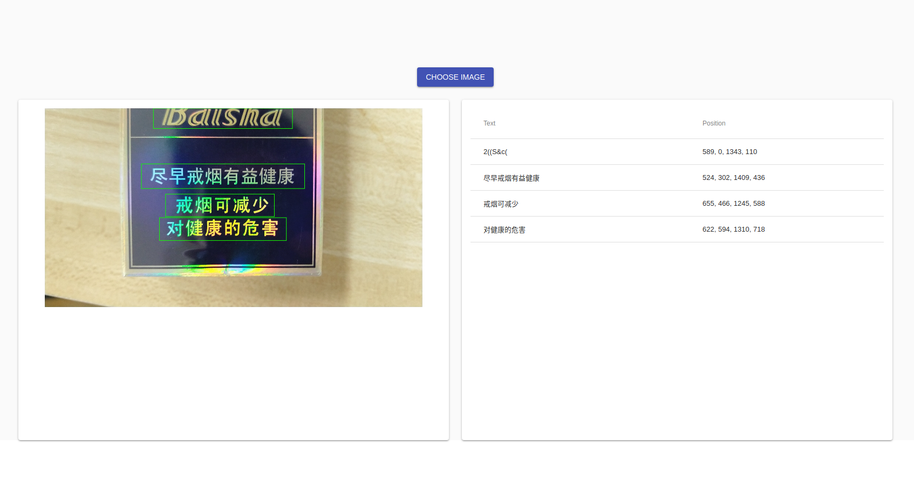

# DeepOcrService


Todo:
- [ ] English crnn model

# Requirements
- Ubuntu 16.04
- Tensorflow-gpu >= 1.6

# How to use

Get code:
```
git clone --recursive git@github.com:Sanster/DeepOcrService.git
```

Install dependencies:
```
pip3 install -r requirements.txt
```

Download models:

- Download `ctpn_vgg16.pb` and `crnn_raw.pb` from [sanster/models](https://github.com/Sanster/models)
, save to `data/models`. 
- Rename `ctpn_vgg16.pb` as `ctpn.pb`, rename `crnn_raw.pb` as `crnn.pb`.

Build Cpython code:
```
make -C tf_ctpn/lib
```


# Start web app
```
python3 app.py
```

Visit http://localhost:5000

# Do infer on command line
```
python3 infer.py \
--img_dir= \
--viz
```

Press `ESC` to exit. Press `Space` to continue.


